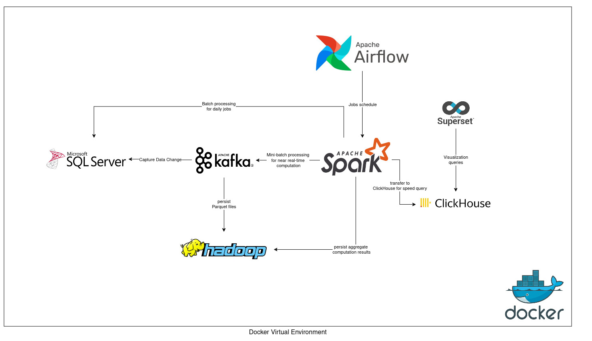

# This project implements an end-to-end tech stack for a data platform
follow Data Lake-House architecture, there are main interfaces of this platform: 
- Distributed query/execution engine: Spark Thrift Server
- Stream processing: Kafka
- Storage: HDFS
- Data mart: ClickHouse
- Orchestration: Airflow
- Main file format: Parquet with Snappy compression
- Warehouse table format: Hive and Iceberg

### How-to-run will be uploaded later

# First run:
0. Install external dependencies:
- Install JDK 23: https://download.oracle.com/java/23/latest/jdk-23_linux-aarch64_bin.tar.gz
- Install Hadoop 3.4.0: https://download.oracle.com/java/23/latest/jdk-23_linux-aarch64_bin.tar.gz

Extract downloaded files to `/services/airflow/dependencies` and extract them
 
1. Change the variable IS_RESUME in ./services/metastore/docker-compose.yml to False

2. Grant all permissions for HDFS
```
sudo mkdir -p ./services/hadoop/data
sudo chmod  777 ./services/hadoop/data/*
```

1. Create docker network
`docker network create default_net`

1. Docker up
`bash start_all_service.sh`

After finishing all the above steps, change IS_RESUME back to True then rerun start all service

5. Check UI page of running services
- Apache Airflow: localhost:8080
- Spark Master UI : localhost:8082
- Spark Thrift UI: localhost:4040

6. Services ports for TCP connections
- Spark Master: localhost:7077 
- Spark Thrift: localhost:10000
- MSSQL Server: localhost:1433 - user: root - password: root@@@123 